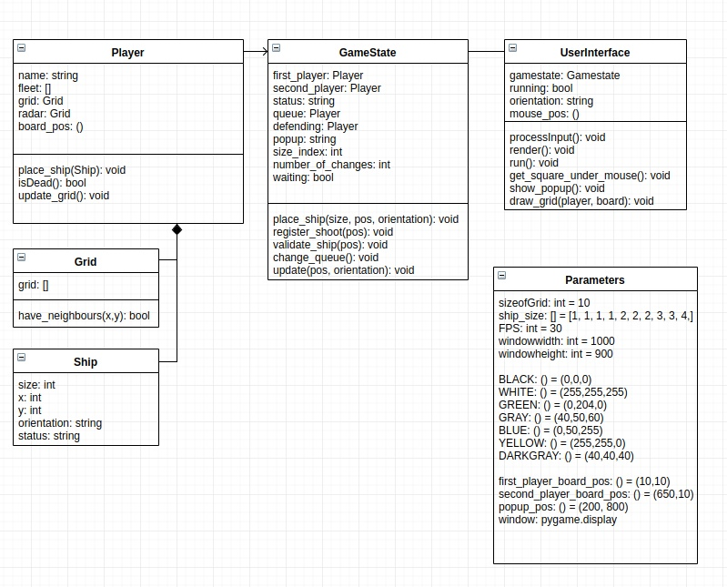

Морской бой
---
Морской бой - игра на двоих людей, с которой знаком каждый человек.

---
Как запустить?
---
```angular2html
git clone https://github.com/teserk/project_battleship.git
cd project_battleship
cd src
pip install -r requirements.txt
python3 main.py
```

---
UML Диаграмма классов
---
